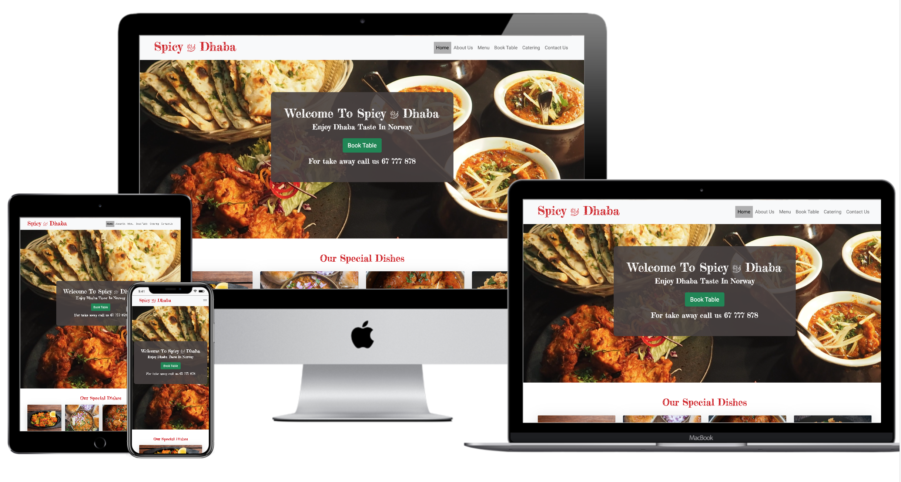

# SPICY DHABA
[View the live project here.](https://rajendradanve.github.io/spicy-dhabha/index.html)

This website is created as a first milestone project using HTML and CSS. 
Website target Indian reasturant with some special dishes. In this reasturant it is possible to book a table online before visiting so that people don't need to wait or it is possible to order take away. 
Menu is available for view. Chef has some special menu items. 

reasturant is also offering catering services to parties. To start discussion it is required to contact reasturant directly or send the form. 
<h2></h2>

--------

## User Experience (UX)

-   ### User stories
        
    - User shall able to get quick information about the reasturant.
    - User shall able to navigate throughout the site easily and find the information based on navigation items.
    - User shall able contact reasturant easily.

-   ### Design
    -   #### Colour Scheme
        -   Heading color used is red. Other text is color is black. Red color choose to indicate hotness of spices.
    -   #### Typography
        -   Fonts for header used is "Fredericka the Great". For menu name decorative cursive font "Rancho" used. For other general fonts "Roboto" font is used.
    -   #### Imagery
        -   Images mostly related to reasturant are used and Indian foods are used throughout the site.

*   ### Wireframes
    -   Wireframe for this project is done using Balsamiq Wireframe software. Images can be found at [this link](https://github.com/rajendradanve/spicy-dhabha/blob/master/Spicy-dhaba-wireframe.zip)
--------
## Features
-   Existing Features
    -   Responsive Design
    -   Able to send book table request and contact reasturant via filling data in the form.

-   Features for next updated
    -   Take Away Menu Selection and possibility to order through form checkin and generating checkout list.
    -   Showing only possible timing and date for booking table.
    -   Chat functionality
    -   Online functionality

--------
## Technologoies used

 ### Languages Used

-   [HTML5](https://en.wikipedia.org/wiki/HTML5)
-   [CSS3](https://en.wikipedia.org/wiki/Cascading_Style_Sheets) 

### Frameworks, Libraries & Programs Used

1. [Bootstrap 5.0.0:](https://getbootstrap.com/docs/5.0/getting-started/introduction/)
    - Bootstrap was used to assist with the responsiveness and styling of the website.
1. [Google Fonts:](https://fonts.google.com/)
    - Google fonts were used to import the 'Titillium Web' font into the style.css file which is used on all pages throughout the project.
1. [Font Awesome:](https://fontawesome.com/)
    - Font Awesome was used on all pages throughout the website to add icons for aesthetic and UX purposes.
1. [jQuery:](https://jquery.com/)
    - jQuery came with Bootstrap to make the navbar responsive but was also used for the smooth scroll function in JavaScript.
1. [Git](https://git-scm.com/)
    - Git was used for version control by utilizing the Gitpod terminal to commit to Git and Push to GitHub.
1. [GitHub:](https://github.com/)
    - GitHub is used to store the projects code after being pushed from Git.
1. [Photoshop:](https://www.adobe.com/ie/products/photoshop.html)
    - Photoshop was used to create the logo, resizing images and editing photos for the website.
1. [Balsamiq:](https://balsamiq.com/)
    - Balsamiq was used to create the [wireframes](https://github.com/rajendradanve/spicy-dhabha/tree/master/assets/docs/wireframe) during the design process.
 For responsive design well known [Bootstrap library](https://getbootstrap.com/)  is used.

--------
## Bugs

1. 20.01.21 - Hamburger button doesn't collapse back nav menu items.
 Solution- Solved by using correct example from bootstrap documentation.

2. Modal Design coming up before book table form validation. 
  Solution-  Due to limited use of HTML and CSS it is not possible to introduced this at current level of knowlede.
  So Modal code is removed from the book-table.html. Instead it is redirected to thank-you.html page

3.  Between 990px to 1050px navbar text for some items making it bigger and also social icons are coming below one another.
    Solutuion- Between 990px to 1050px "about us" and "contact us" navbar items are added under dropdown of "more".

--------
## Testing

The W3C HTML Markup Validator and W3C CSS Validator Services were used to validate every page of the project to ensure there were no syntax errors in the project.

### Testing User Stories from User Experience (UX) Section

-   As a visitor, I want to easily understand the what is reasturant about and what can they offer.
    -   When user visit site they easily see clean navigation bar.
    -   On the overlap section over hero image link to book table is provided. Also alternatively phone number for take away order is provided.
    -   On the home page special dishes from the reasturant are provided for quick view to make customer to know the speciality of the reasturant.

-   As a visitor, it is important to navigate easily and find the informaion required.
    -   Clean and self explanatary navigation menu items are provided. Active navigation item is marked with light gray background. 
    -   For the smaller screen sizes collapsable navigation bar is made. 

-   User shall able to contact reasturnat easily.
    -   Provided good looking form for contacting reasturant. Also phone number is provided for quick contact and take away.

### Further Testing

-   The Website was tested on Google Chrome, Microsoft Edge and Safari browsers.
-   The website was viewed on a variety of devices such as Desktop, Laptop, andriod phones.
-   Testing was done to ensure that all links work correctly.

### Known Bugs

-   Between 980 to 1030 px width margin between opening time and map becomes zero. Some overlapping happens at some points.
    
--------
## Deployment

The project was deployed to GitHub Pages using the following steps...

1. Log in to GitHub and locate the [GitHub Repository](https://github.com/rajendradanve/spicy-dhabha)
2. At the top of the Repository, locate the "Settings" Button on the menu.
3. Scroll down the Settings page until you locate the "GitHub Pages" Section.
4. Under "Source", click the dropdown called "None" and select "Master Branch".
   The page will automatically refresh.
5. Scroll back down through the page to locate the now published [site link](https://rajendradanve.github.io/spicy-dhabha/) in the "GitHub Pages" section.

--------
## Credits

1. Images - Images for these projects are downloaded from [pexels](pexels.com), [unsplash](unsplash.com), [pixabay](pixabay.com). Images are free to use.
2. Logo - Created using [freelogodesign](freelogodesign.org)
3. Fonts- Google fonts - Main font used is "Roboto". For Logo name, heading and sub-heading "Fredericka the Great" font used. For card title "Rancho" font is used.
4. Icons - Font Awsoms icon library used by importing CSS in the head section.
5. Full screen hero image css code taken from [this link](https://css-tricks.com/perfect-full-page-background-image/)
6. [Bootstrap5](https://getbootstrap.com/docs/5.0/getting-started/introduction/): Bootstrap 5.0 Library used throughout the project mainly to make site responsive using the Bootstrap Grid System.
7. 

### Acknowledgements

-   My Mentor for continuous helpful feedback regarding layout and colors etc.

-   Tutor support at Code Institute for their support to solve some of the layout issues.